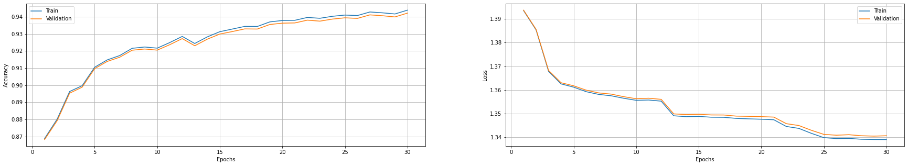
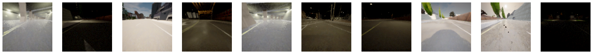
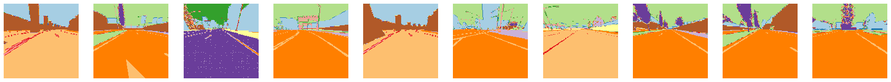
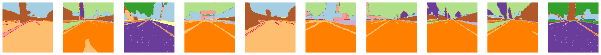
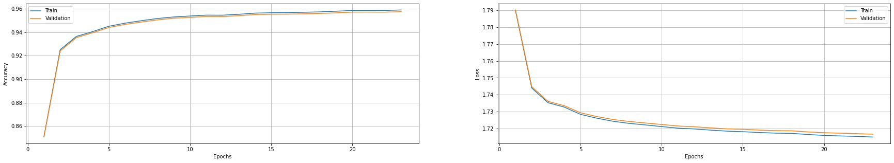
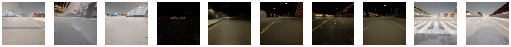
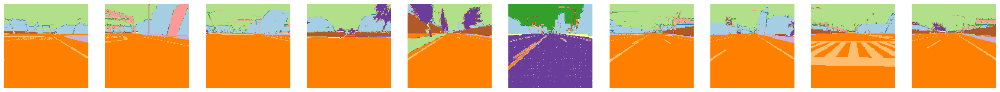
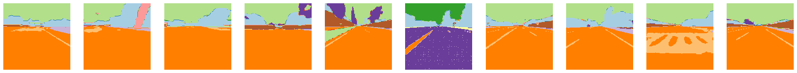

# Semantic Segmentation Autoencoder for Autonomous Agent in CARLA

This repository is an implementation of the autoencoder architecture explored in [this paper](https://arxiv.org/abs/1902.03765#:~:text=Latent%20Space%20Reinforcement%20Learning%20for%20Steering%20Angle%20Prediction,-Qadeer%20Khan%2C%20Torsten&text=Model%2Dfree%20reinforcement%20learning%20has,in%20a%20high%2Dfidelity%20simulator) used for the task of semantic segmentation for my final year project in Data Science and Analytics.

## Dataset
The dataset used in this project consists of #120,000 RGB images collected from the CARLA simulator and their corresponding semantically labelled images which act as the 'ground truth'.

## Training procedure
Two loss functions were explored, a Tversky Dice weighted cross entropy and a weighted cross entropy loss (the weights correspond to the inverse frequency of the class label). As seen below, this network converges faster when using a weighted cross entropy loss. The training process can be seen in the rgb to sem ae notebook.
  
## Results
### Tversky Dice Weighted Cross Entropy
Training Metrics:

Original Images:

Original Masks:

Predicted Masks:

### Weighted Cross Entropy
Training Metrics:

Original Images:

Original Masks:

Predicted Masks:
